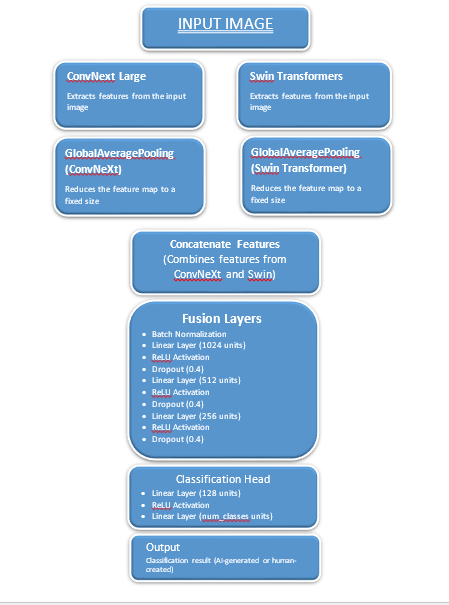
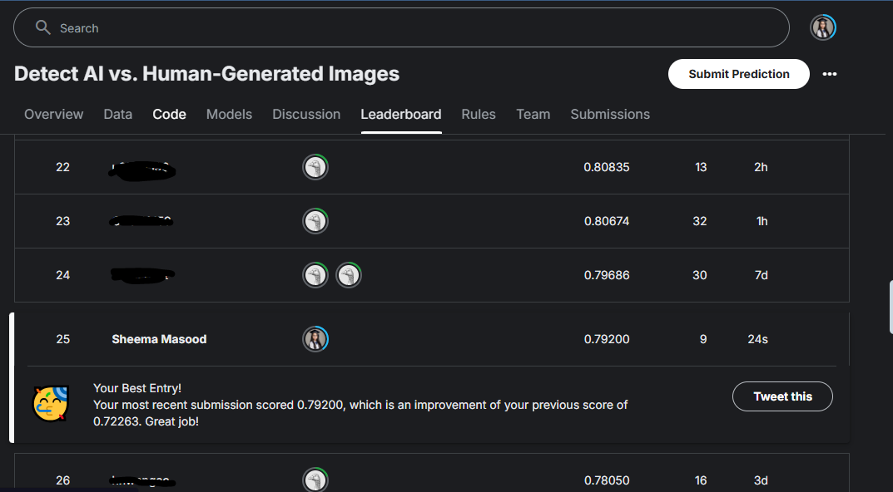

# Detect_AI_vs_Human_Generated_Image

A deep learning-based model to distinguish between AI-generated and human-created images. This repository includes data preprocessing, model training (ConVitX with ConvNeXt Large and Swin Transformer), evaluation using F1-score, and real-time deployment. Built for the Kaggle competition "Can You Tell the Difference?"

## Table of Contents

- [Introduction](#introduction)
- [Dataset](#dataset)
- [Model Architecture](#model-architecture)
- [Training](#training)
- [Evaluation](#evaluation)
- [Deployment](#deployment)
- [Usage](#usage)
- [Files](#files)
- [Contributing](#contributing)
- [License](#license)
- [Contact](#contact)

## Introduction

The goal of this project is to develop a deep learning model capable of distinguishing between images generated by AI and those created by humans. This is achieved using a combination of ConvNeXt Large and Swin Transformer architectures, named ConVitX.

## Dataset

The dataset used for this project is provided by the Kaggle competition "Can You Tell the Difference?". The dataset includes a variety of images, both AI-generated and human-created.

## Model Architecture

The model architecture consists of:
- **ConVitX**: A custom model constructed by combining ConvNeXt Large and Swin Transformer architectures.
- **ConvNeXt Large**: A convolutional network architecture designed for high performance on image classification tasks.
- **Swin Transformer**: A transformer architecture with shifted windows for efficient image processing.
  

## Training

The model is trained using the following steps:
1. Data preprocessing
2. Model training with ConVitX
3. Hyperparameter tuning

## Evaluation

The model is evaluated using the F1-score metric to ensure a balanced measure of precision and recall.

## I secured 25th position on the public leaderboard

## Deployment

The trained model is deployed for real-time image classification, allowing users to input images and receive predictions on whether they are AI-generated or human-created.

## Usage

To use the model for image classification, follow these steps:
1. Clone the repository: `git clone https://github.com/SheemaMasood381/Detect_AI_vs_Human_Generated_Image.git`
2. Install the required dependencies: `pip install -r requirements.txt`
3. Run the classification script: `python classify_image.py --image_path path_to_image`

## Files

- `README.md`: Project overview and instructions
- `app.py`: Main application script for deployment
- `inference.py`: Script for making inferences with the trained model
- `lb.PNG`: Leaderboard snapshot showing 28th position
- `load_model.py`: Script for loading the trained model
- `model.py`: Model architecture definition
- `notebooks/`: Directory containing Jupyter notebooks for experimentation
- `requirements.txt`: List of dependencies required for the project

## Contributing

Contributions are welcome! Please follow these steps to contribute:
1. Fork the repository
2. Create a new branch: `git checkout -b feature-branch`
3. Make your changes
4. Commit your changes: `git commit -m 'Add new feature'`
5. Push to the branch: `git push origin feature-branch`
6. Create a pull request

## License

This project is licensed under the MIT License. See the [LICENSE](LICENSE) file for details.

## Contact

Feel free to reach out to me on [LinkedIn](https://www.linkedin.com/in/sheema-masood/) for any queries or collaborations.

